---
hide:
  # - navigation
  # - toc
title: Stampa semplice e atlante
description: Due esempi di stampa semplice e stampe in serie
---

# Esempi

## Introduzione

!!! Abstract "Intro"

    In questo capitolo vedremo due esempi base, uno su un semplice layout e uno su un semplice atlante.

## Layout di stampa semplice

Dati: Regioni [ISTAT](../../dati/index.md) (1)
{ .annotate }

1.  :man_raising_hand: --> Cliccare su ISTAT e copiare il link OTF o scaricare la risorsa

Quesito:

- realizzare una composizione di stampa (formato pagina A4 orizzontale) in cui sia visibile:

    1. la mappa dell'intera penisola (categorizzata) suddivisa per regioni;
    2. la legenda;
    3. la scala grafica;
    4. la freccia del Nord;
    5. Intestazione;
    6. Credits;
    7. logo di QGIS
    8. stampare.

### Importare e tematizzare strato

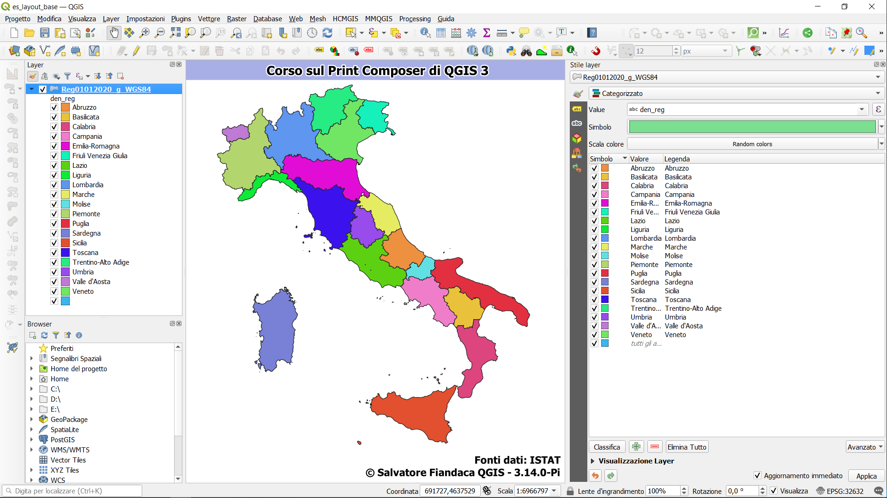

Tematizzo tramite categorizzazione, uso attributo `den_reg`.

### Creare nuovo Layout di stampa

Per creare un nuovo layout:

1. usando il Menu Progetto | Nuovo Layout di Stampa... (1)
2. usando le icone nella barra degli strumenti (2)
3. usando la tastiera `Ctrl+P`;

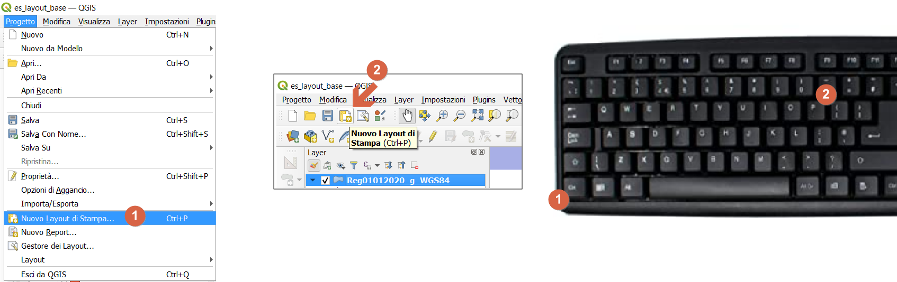

comparirà la seguente finestra:

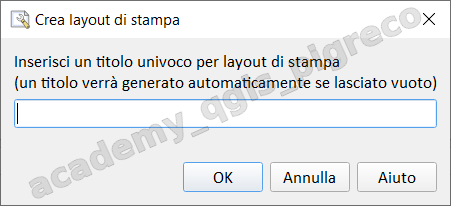

Inserisci titolo univoco e pigiare su `OK`

### Compositore di stampe

dopo l' `OK`, si aprirà il compositore di stampe e vedremo:

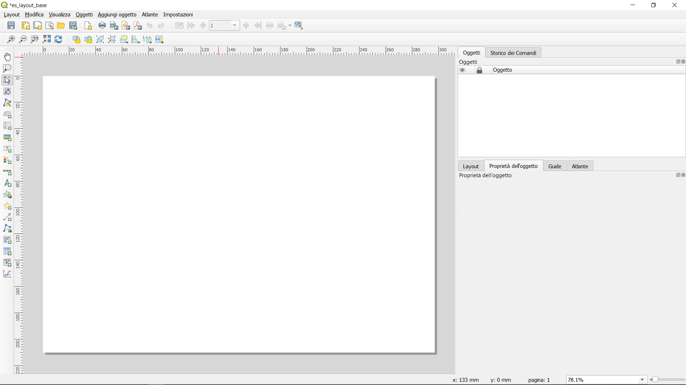

per impostazione predefinità, la pagina è settata come A4 orizzontale.

### Aggiungere mappa

Dalla barra degli strumenti,

pigiare `Aggiungi Mappa`  e traccia un rettangolo (circa metà pagina) nella pagina bianca:

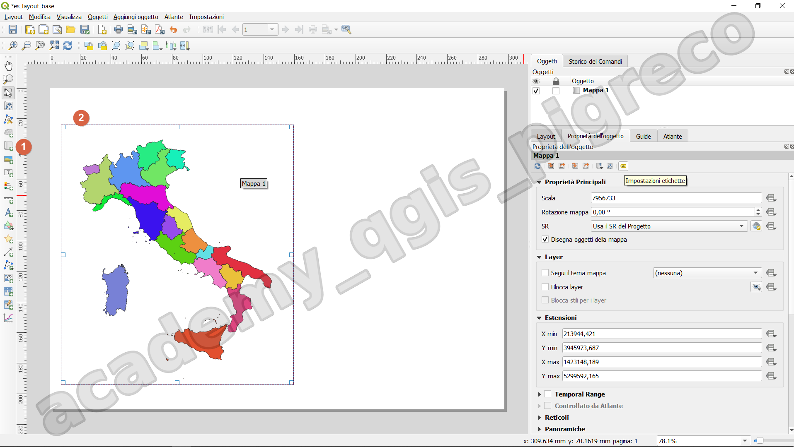

verrà visualizzato il contenuto della `map canvas`, nel nostro esempio l'italia tematizzata. Al riquadro mappa appena aggiunto verrà assegnato un nome oggetto `Mappa 1` (visibile in alto a destra, nel Pannello Oggetti). Se volessimo modificare il nome, doppio clic su Mappa 1.

### Aggiungere legenda

Sempre dalla barra degli strumenti, piagiare  `Aggiungi legenda` 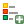 e traccia un rettangolo a lato della mappa:

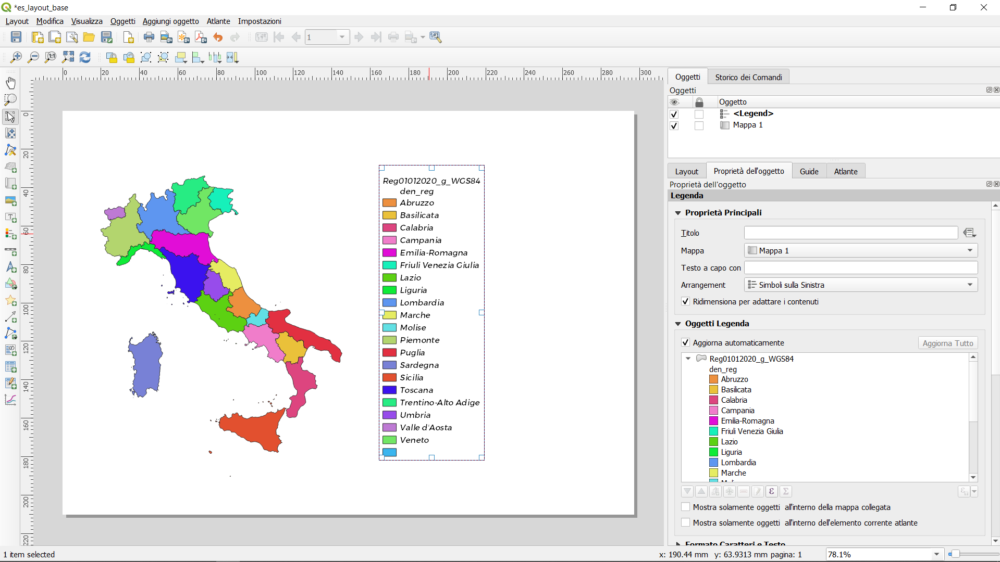

Per modificare o aggiungere `Titolo` alla legenda, utilizzare il Pannello `Proprietà dell'oggetto` (visibile dopo la selezione dell'oggetto.)

Nel nostro caso abbiamo solo una mappa e quindi la legenda è relativa all'unica mappa presente.

### Aggiungere Scala grafica

Sempre dalla barra degli strumenti, pigiare  e tracciare un piccolo rettangolo, per esempio sotto la mappa:

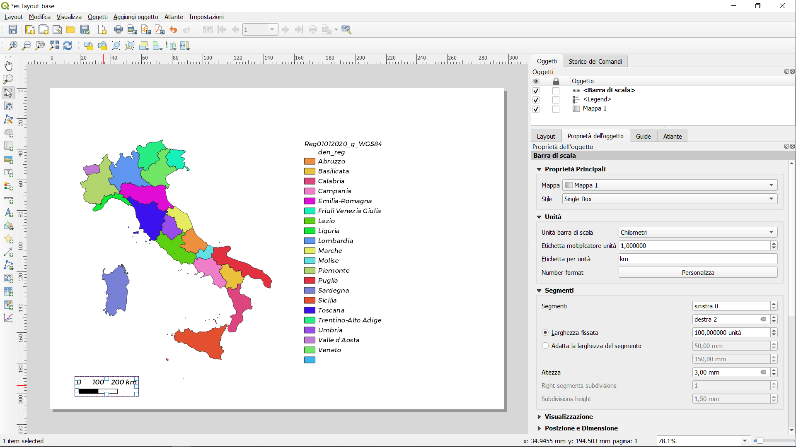

Nel nostro caso abbiamo solo una mappa e quindi la Barra di scala è relativa all'unica mappa presente. Dalle proprietà è possibile configurare molti parmatri e stili della barra di scala.

### Aggiungere freccia del Nord

Sempre dalla barra degli strumenti, pigiare  e tracciare un piccolo rettangolo, per esempio sotto la mappa:

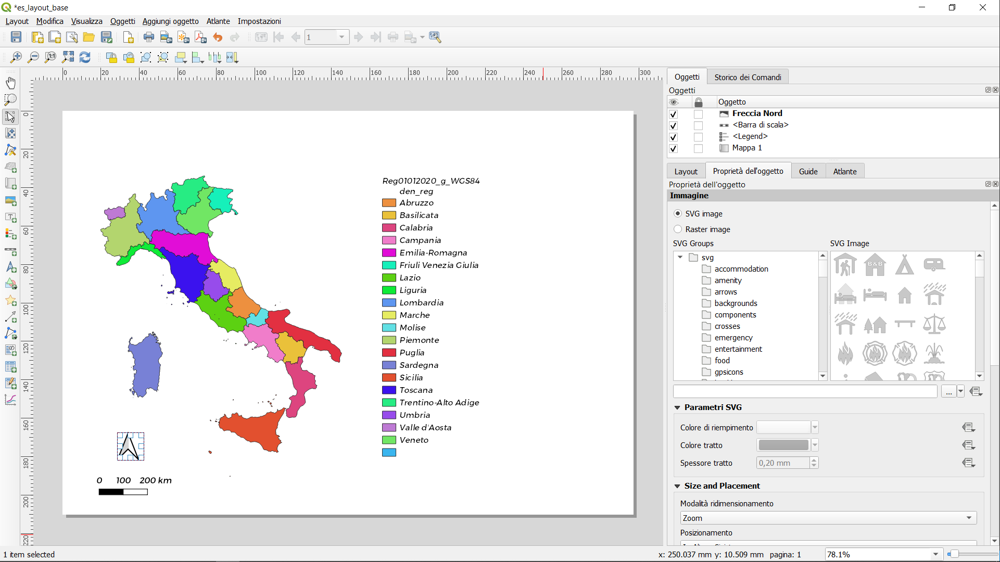

Dal Pannello Proprietà dell'oggetto è possibile definire molti altri parametri e cambiare anche la forma della freccia.

### Aggiungere Intestazione

Per aggiungere una intestazione o titolo al layout, pigiare `Aggiungi Etichetta`  dalla Barre degli strumenti, tracciare un rettangolo sopra la mappa:

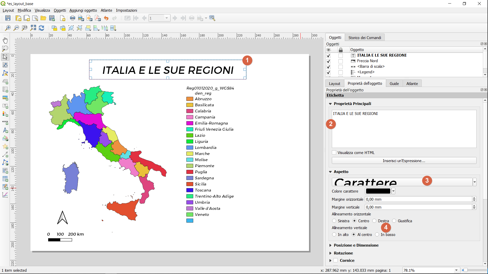

1. disegna rettangolo
2. scrivi il testo
3. formatta carattere
4. allineamento testo.

### Aggiungere Credits

È buona norma aggiungere sempre, in basso a destra della pagina, una etichetta con scritto `Realizzato con QGIS`:

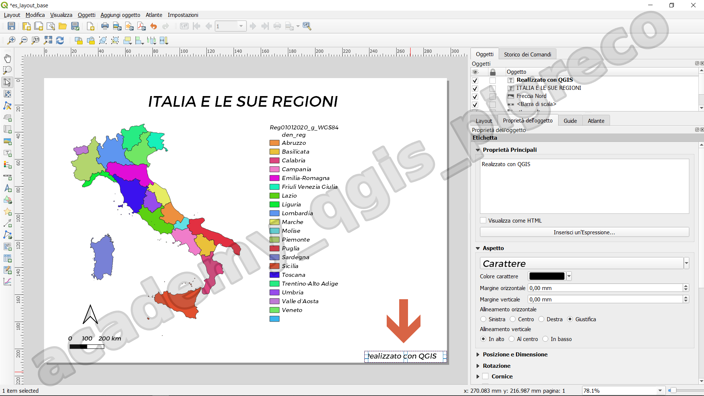

### Aggiungere immagine

Sempre dalla barra degli strumenti, pigiare  e tracciare un piccolo rettangolo, per esempio sopra i Credits:

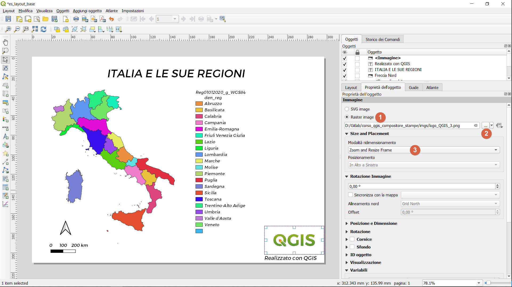

1. selezionare `Raster Image`
2. cliccare nei tre puntini `...` per cercare l'immagine nel nostro PC
3. selezionare `Zoom and Resize Frame` per sistemare meglio l'immagine.

### Stampare layout

Dopo aver sistemato meglio ogni oggetto, possiamo stampare:

- direttamente con la stampante;
- come immagine;
- come SVG;
- come PDF.

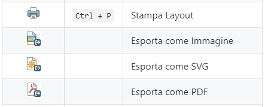

### Stampa

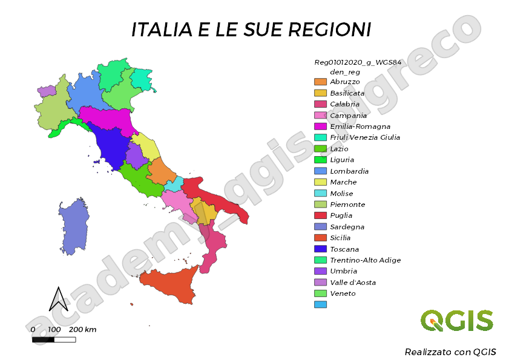

## Atlante

Un **atlante** è una stampa in serie dove viene definito un **layer di copertura**, le pagine di output sono pari, o minori, al numero delle feature del layer di copertura.

Il layout costruito sopra potremmo utilizzarlo come base di partenza per generare un atlante: cioè generare tante pagine quante sono le regioni italiane, una pagina per regione.

Occorre fare delle piccole modifiche e aggiunte:

1. togliamo la legenda, la scala grafica e la freccia perché non ci servono;
2. la `Mappa 1` la rinominiamo in `atlas` e la usiamo per definire l'atlante;
3. come layer di copertura utilizziamo le regioni;
4. aggiungiamo una panoramica, in modo da capire dove si trova la regione corrente rispetto tutta l'Italia.

Per rinominare la `Mappa 1`, selezionarla e fare doppio clic nel nome sul panello Oggetto e ridimensionare il rettangolo della mappa:

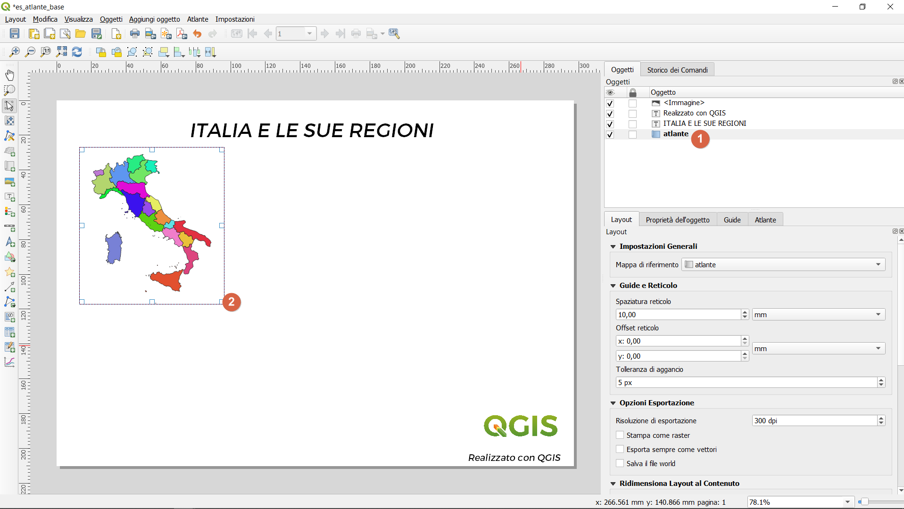

### Creare l'atlante

Dal menu Atlante (1), cliccare su `Imposta Atlante` (2) oppure cliccare direttamente sul pannello Atlante (3):

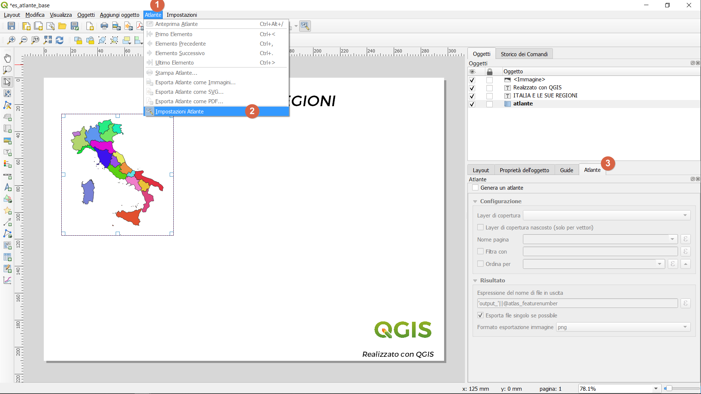

mettere una spunta su `Genera un atlante` per attivare la procedura:

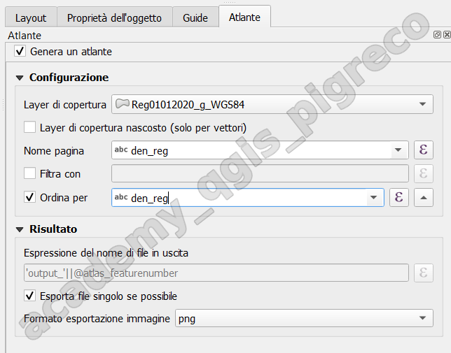

come layer di copertura possiamo usare solo quello delle regioni, come Nome pagina segliamo l'attributo che contiene il nome delle regioni `den_reg`, infine possiamo ordinare le pagine dell'atlante.

A questo punto è quasi tutto pronto, dobbiamo solo dire a QGIS quale mappa (nel nostro caso è presente solo una `atlante`) deve essere `controllato da atlante`: selezionare la mappa `atlante` e dalle proprietà oggetto, mettere la spunta su `Controllato daatlante`:

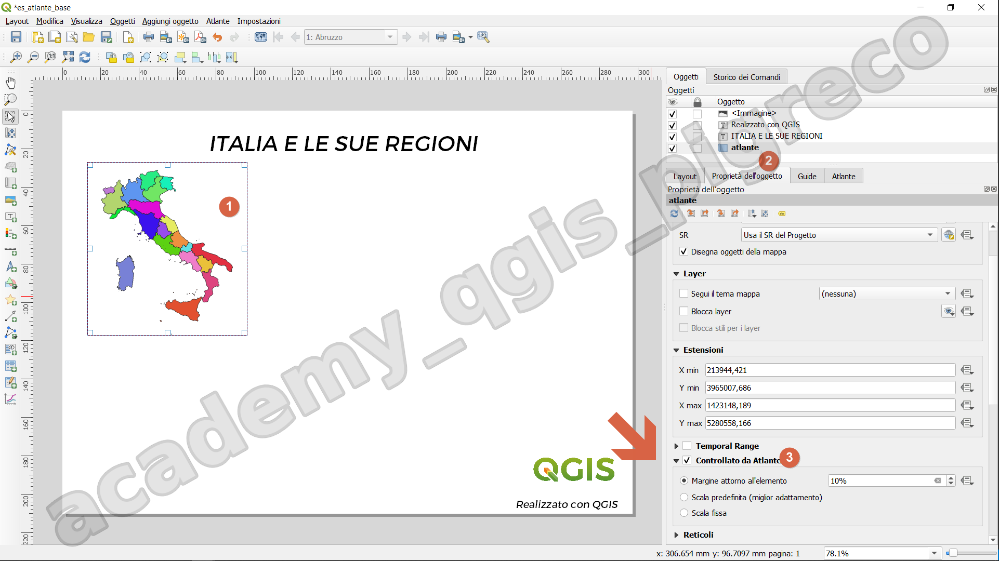

### Aggiungere Panoramica

La panoramica non è altro che una mappa statica che ci permette di contestualizzare l'atlante rispetto un contesto più generale, nel nostro caso l'intera Italia.

Aggiungiamo un'altra mappa al layout pigiando sempre  e disegnando un rettangolo affianco alla mappa `atlante`:

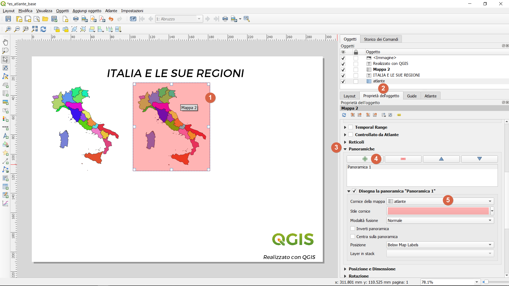

1. selezionare la panoramica, cioè la `Mappa 2`;
2. da Proprietà dell'Oggetto,
3. cercare `Panoramiche`;
4. aggiungere una panoramica;
5. selezionare la Cornice della mappa, cioè `atlante`.

### Aggiungere tabella attributi

Dalla barra degli Strumenti, pigiare su `Aggiungi Tabella Attributi` , disegnare sotto le mappe un rettangolo e dalle proprietà dell'oggetto selezionare come sorgente `Current atlate Feature`:

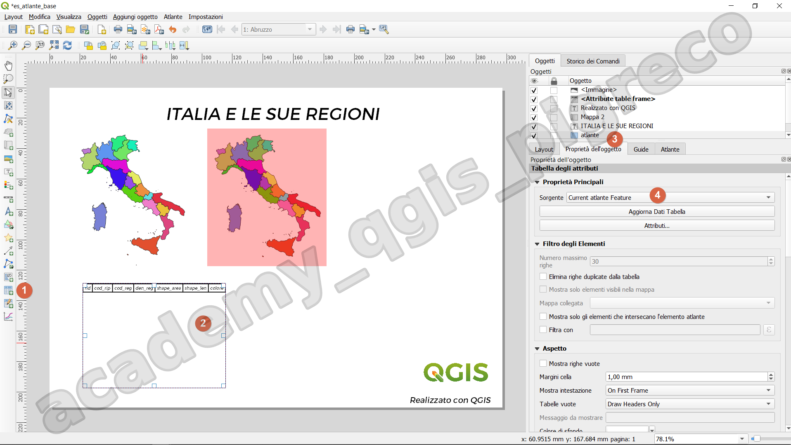

### Aggiungere etichetta nome regione

Per aggiungere una etichetta dinamica, pigiare `Aggiungi Etichetta`  dalla Barre degli strumenti, tracciare un rettangolo sopra la mappa, nel nostro caso modifichiamo quella già inserita: cancelliamo il contenuto e utilizaimo `Inserisci un'Espressione`, ovvero utilizziamo il campo che contiene il nome delle regioni `den_reg`:

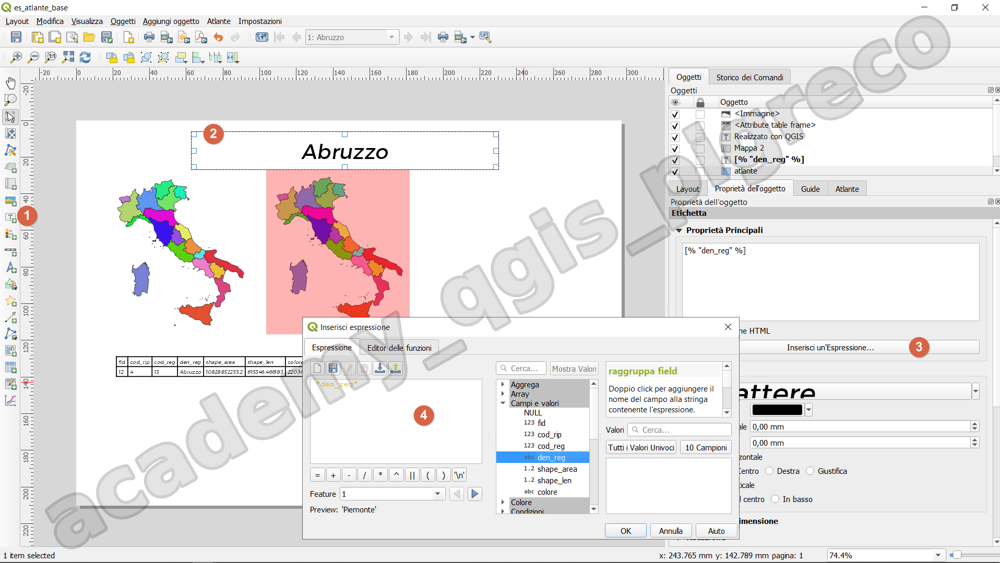

A questo punto ATTIVIAMO l'atlante pigiando sull'icona `Anteprima Atlante` , il risultate è:

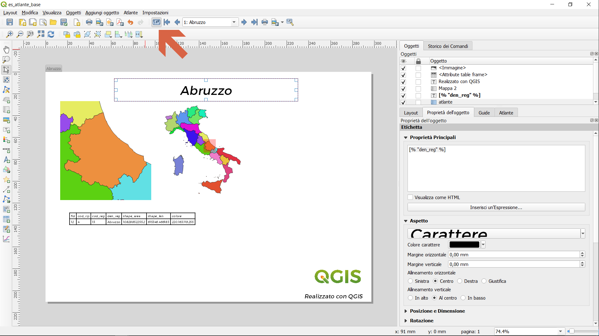

### Stampare Atlante

Dopo aver sistemato meglio ogni oggetto, possiamo stampare in serie:

- direttamente con la stampante;
- come immagine;
- come SVG;
- come PDF.

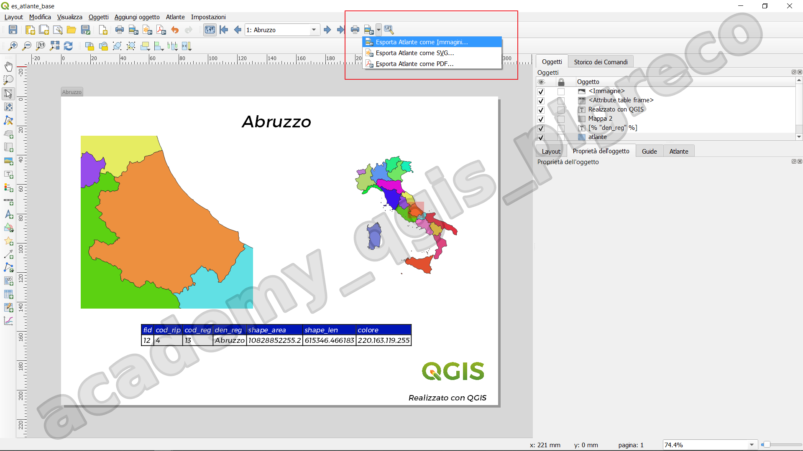

gif animata:

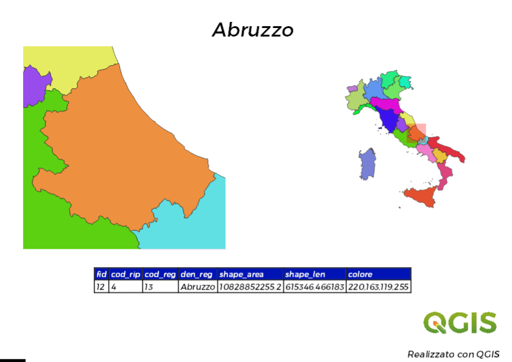

{!includes/disclaimer.md!}.
