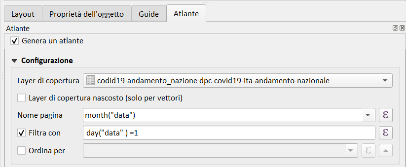
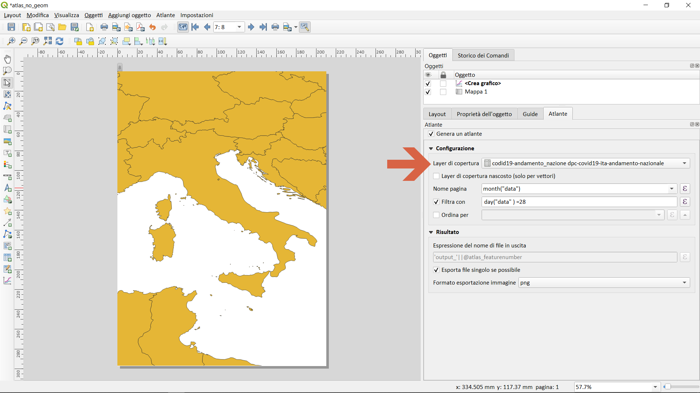
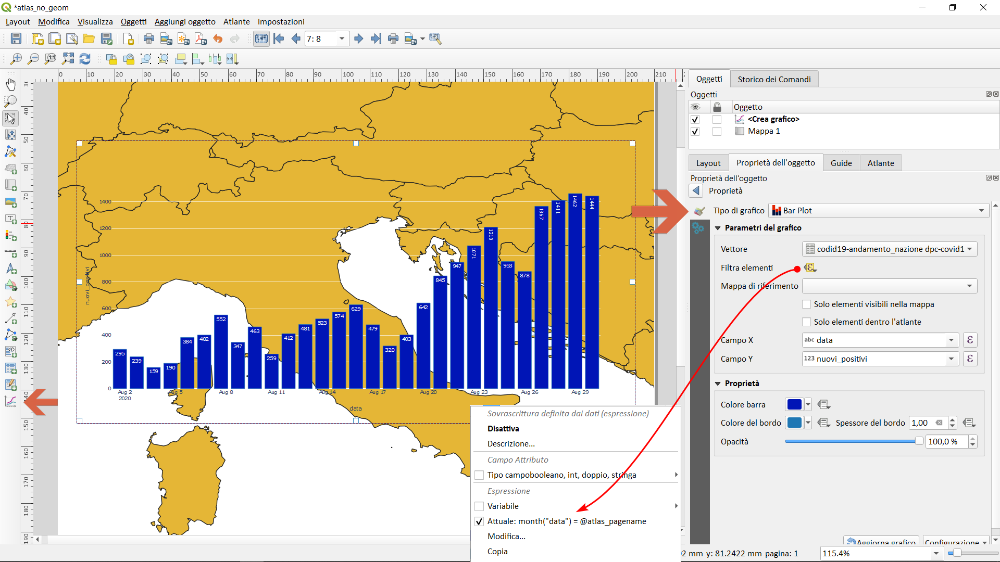
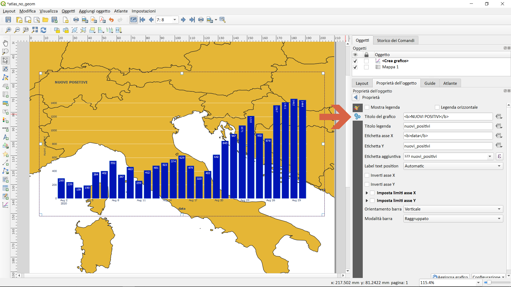
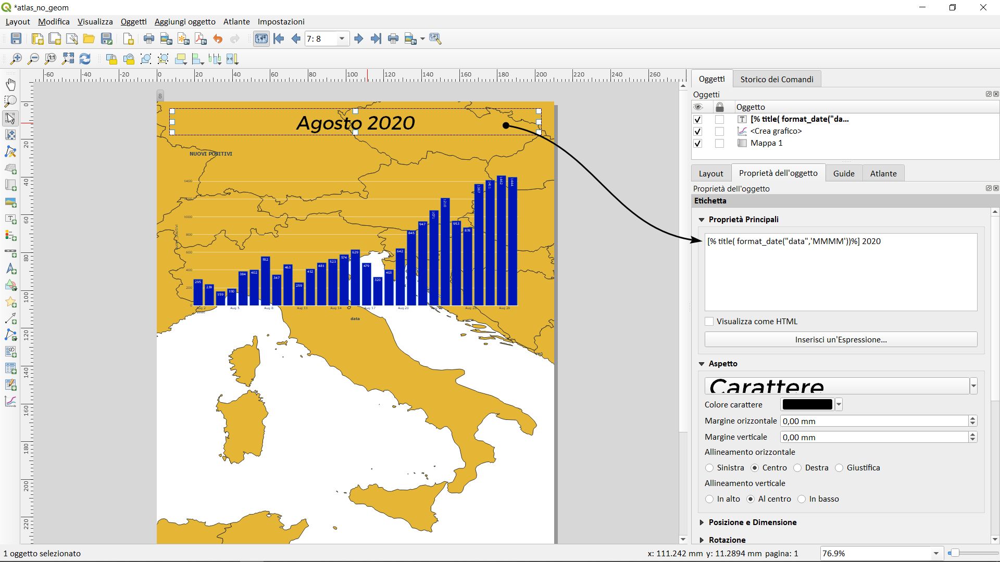
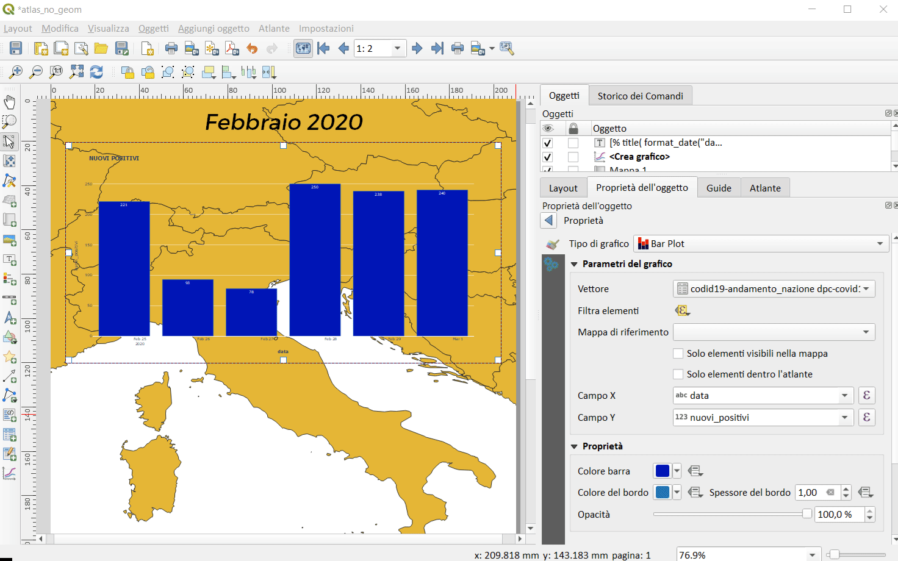
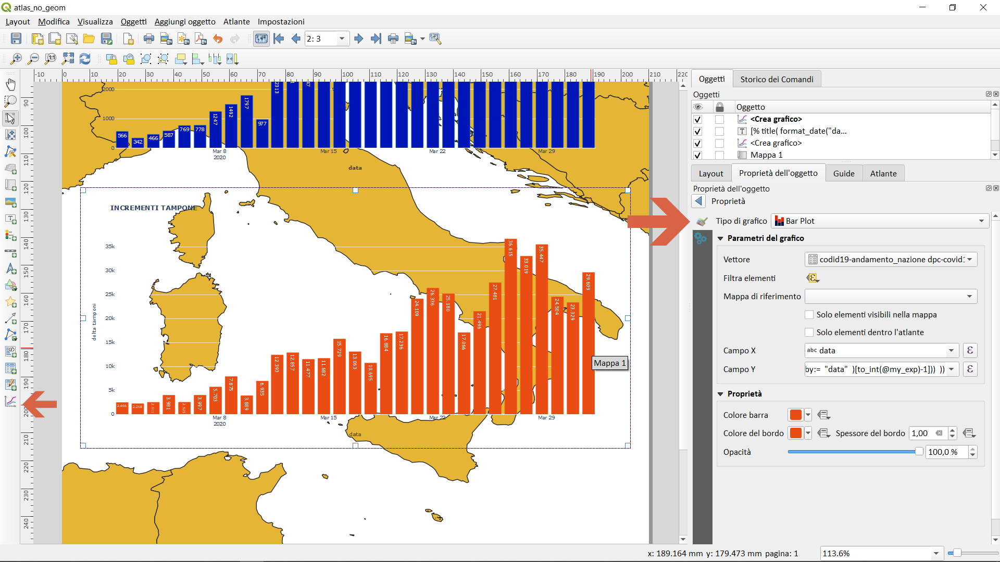
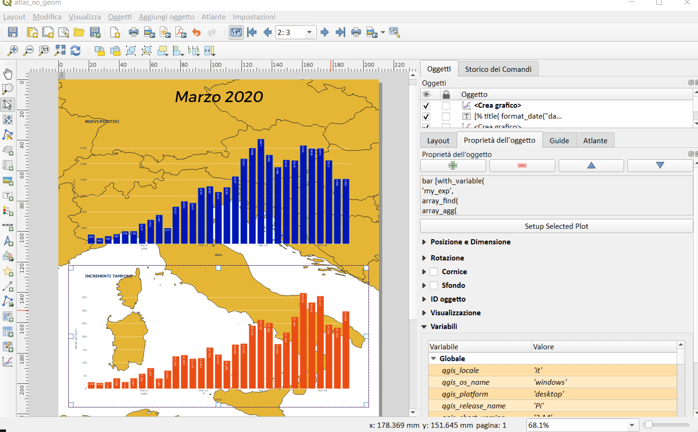

---
hide:
  # - navigation
  # - toc
title: Atlante senza geometria
description: Atlante con layer di copertura una semplice tabella senza geometria.
---

# Esempio avanzato di atlas senza geometria

## Introduzione

!!! Abstract "Intro"

    Come abbiamo già detto nel capitolo dei vettori di copertura, è possibile realizzare degli atlas utilizzando come _layer di copertura_ una semplice tabella senza geometria. In questo capitolo vedremo un esempio reale su come realizzarlo utilizzando i dati sul **COVID-19**.

Dati

## Descrizione Atlas

Realizzare un atlas a partire dai dati sul [COVID-19](https://github.com/pcm-dpc/COVID-19) e in particolare utilizzando il [file](https://github.com/pcm-dpc/COVID-19/blob/master/dati-andamento-nazionale/dpc-covid19-ita-andamento-nazionale.csv) `covid19-andamento_nazionale`. L'atlas deve rappresentare, tramite grafici e su sfondo statico l'Italia, dati giornalieri (distinti per mense) dei principali paramenti medici, ogni pagina dell'atlas rappesenterà un mese.

## Costruzione Atlante

### Creare atlas

Layer di copertura la semplice tabella senza geometria:

- Layer di copertura : `covid19-andamento_nazionale`
- Nome pagina : `month("data")` -- mese in formato numerico
- Filtra con : `day("data") = 1` -- per prendere un sol valore per ogni mese (mesi interi)
- Filtra con : `day("data") = day(array_agg("data", group_by:=month("data")) [0] )`





### Aggiungere grafico

- Tipo grafico : `Bar Plot`
- Vettore : `covid19-andamento_nazionale`
- filtra elementi : `month("data") = @atlas_pagename`
- Campo X : `data`
- Campo Y : `nuovi_positivi`

Il trucco per realizzare l'atlas sta tutto nel filtro `month("data") = @atlas_pagename`; 



### Impostazione grafico

Lo screenshot è autoesplicativo



### Aggiungere etichetta

Espressione utilizzata:

```py
[% title( format_date("data",'MMMM'))%] 2020
```



## Animazione



## Grafico con incrementi giornalieri

Alcuni parametri medici, come il numero di **tamponi**, sono forniti in modo cumulato giorno dopo giorno; vediamo come realizzare il grafico calcolando gli incrementi giornalieri, l'espressione* usata è:

### Campo Y

```py
with_variable( 
'my_exp', 
array_find(  
    array_agg( 
    expression:= "data" ,
    order_by:="data"),"data"),
if( 
to_int(@my_exp) = 0, 
    (array_agg( 
    expression:= "tamponi" , -- parametro medico
    order_by:=  "data"  )[0]),
    ("tamponi" -- parametro medico
    -
    (array_agg( 
    expression:= "tamponi", -- parametro medico
    order_by:=  "data"  )[to_int(@my_exp)-1]))
    )
               )
```



### Etichetta grafico

```py
format_number(
with_variable(
'my_exp', 
    array_find(  
    array_agg( 
    expression:= "data" , 
    order_by:="data"),"data"),
if( 
    to_int(@my_exp) = 0, 
    (array_agg( 
    expression:= "tamponi" , -- parametro medico
    order_by:=  "data"  )[0]),
    ("tamponi" -- parametro medico
    -
    (array_agg( 
    expression:= "tamponi", -- parametro medico
    order_by:=  "data"  )[to_int(@my_exp)-1]))
    )
            ),0)
```


### Animazione



{!includes/disclaimer.md!}
