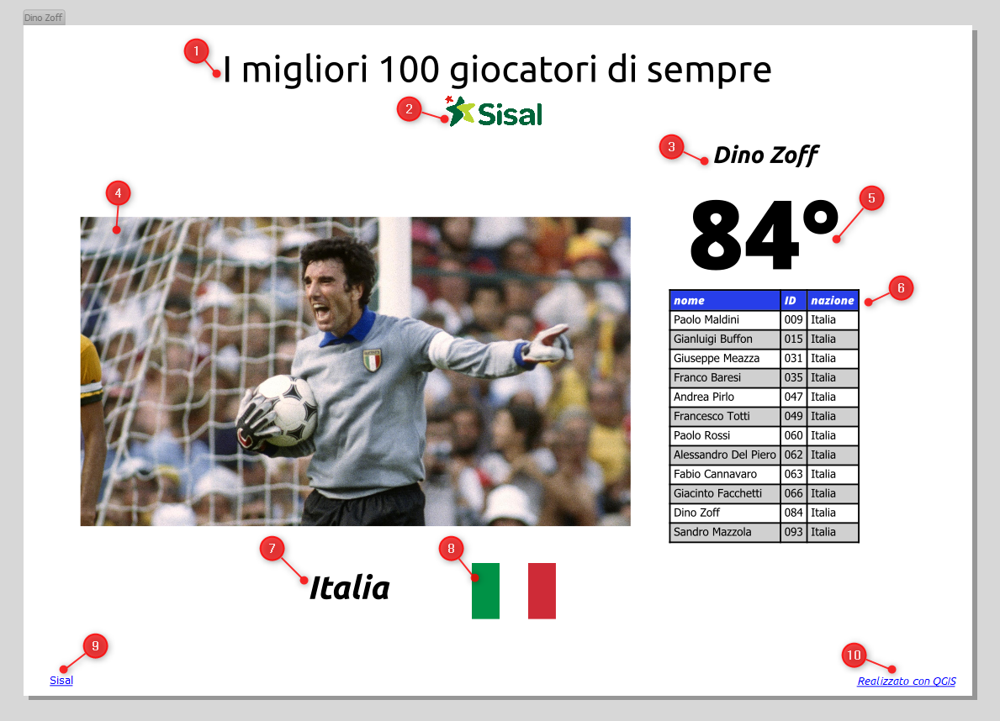
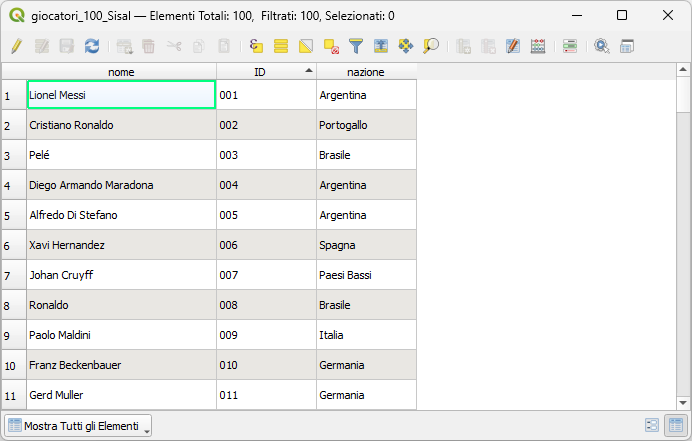
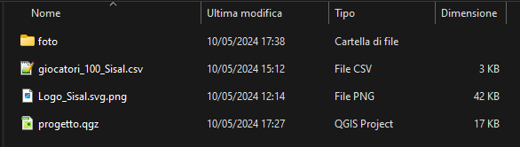
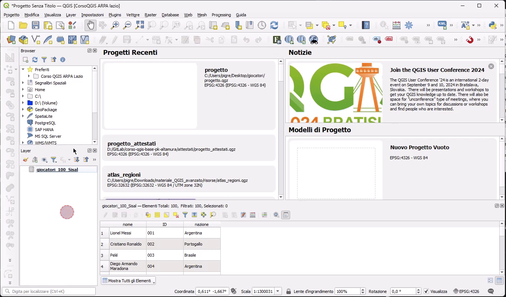
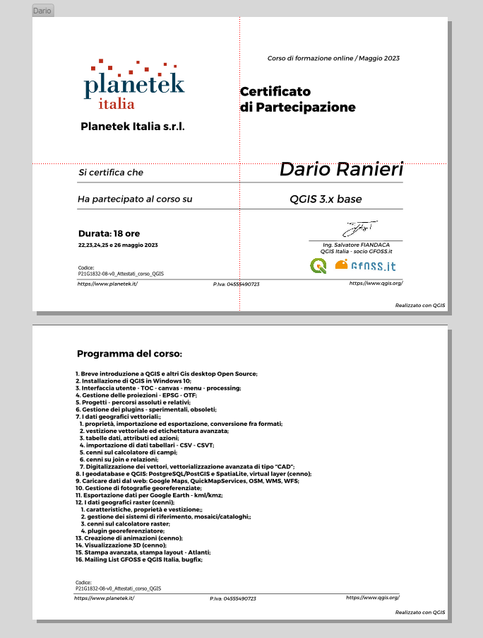

---
hide:
  # - navigation
  # - toc
title: Atlante senza geometria
description: Atlante con layer di copertura una semplice tabella senza geometria.
---

# Esempio avanzato di atlas senza geometria

## Introduzione

!!! Abstract "Intro"

    Come abbiamo già detto nel capitolo dei vettori di copertura, è possibile realizzare degli atlas utilizzando come _layer di copertura_ una semplice tabella senza geometria.

I dati per l'esercitazione sono nella cartella _**material didattico extra**_, cartella `atlas_senza_geometry`

## Descrizione atlante

Realizzare un atlante senza geometria utilizzando i dati sui [100 giocatori di calcio migliori di sempre](https://www.sisal.it/scommesse-matchpoint/blog/fuori-campo/migliori-100-giocatori) (Sisal).

L'atlante avrà i seguenti oggetti:



1. una etichetta statica che conterrà il titolo;
2. il logo di Sisal;
3. una etichetta dinamica che conterrà il nome del giocatore;
4. una foto del giocatore;
5. la posizione nella classifica;
6. una tabella dinamica con filtro legato alla nazionalità del giocatore corrente;
7. nazionalità del giocatore;
8. bandiera della nazione del giocatore;
9. link all'articolo Sisal;
10. credits

## Tabella con i dati



Il file CSV (che ho creato io, è incompleto, ma sufficiente per l'esercitazione) è caratterizzato dalle colonne:

- _**nome**_: che contiene il nominativo del giocatore;
- _**ID**_: che indica la posizione in classifica;
- _**nazione**_: indica la nazione del giocatore.

(potrebbe avere tante altri attributi, come club dove ha giocato, numero di coppe vinte, scudetti ecc...)

## Cartella con le foto



la cartella con le foto è allo stesso livello del file CSV e del file di progetto QGIS.

## Atlante

fasi:

1. carico il file CSV nel progetto;
2. avvio Nuovo compositore di stampe e lo chiamo atlante_giocatori;
3. genero atlante, usando come layer di copertura il file CSV;

=== "carico file CSV"

    

=== "Avvio compositore"

    

=== "genero Atlante"

    

### Popolare layout

1. inserire etichetta e scrivo: _I migliori 10 giocatori di sempre_;
2. nella cartella con i dati dell'esempio è presente una immagine: tramite drag&drop caricarla nel layout;
3. inserire etichetta e popolarla, usando il costruttore di espressioni, con l'attributo "nome";
4. inserire oggetto immagine e dalle proprietà dell'oggetto, attivare Immagine Raster, e poi cliccare su Sovrascrittura definita dai dati | Modifica e incollare `@project_folder ||'/foto/'||"ID"||'.jpg'`;
5. inserire etichetta e popolarla con l'attributo "ID";
6. inserire una tabella e usare un filtro: ` "nazione" =attribute( @atlas_feature ,'nazione')`;
7. inserire etichetta e popolarla con l'attributo "nazione";
8. inserire oggetto immagine e dalle proprietà dell'oggetto, attivare Immagine Raster, e poi cliccare su Sovrascrittura definita dai dati | Modifica e incollare l'espressione (vedi sotto)[^1];
9. inserire etichetta e popolarla con l'espressione `<a href='https://www.sisal.it/scommesse-matchpoint/blog/fuori-campo/migliori-100-giocatori'>Sisal</a>` e attivare Visualizza come HTML;
10. inserire etichetta e popolarla con l'espressione `<a href='https://www.qgis.org/it/site/'>Realizzato con QGIS</a>` e attivare Visualizza come HTML;

## Animazione finale


## Altri esempi

Generare un atlante senza geometria per stampare i certificati di frequenza (sotto un esempio concreto)



[^1]:
    espressione da copiare e incollare per il punto 8:

    questo per far vedere che le immagini possono essere prese direttamente dal web, senza averel necessariemente salvate nel disco.

    ```py
    CASE
    WHEN  "nazione" ='Argentina' THEN 'https://upload.wikimedia.org/wikipedia/commons/1/1a/Flag_of_Argentina.svg'
    WHEN  "nazione" ='Brasile' THEN 'https://upload.wikimedia.org/wikipedia/commons/0/05/Flag_of_Brazil.svg'
    WHEN  "nazione" ='Italia' THEN 'https://upload.wikimedia.org/wikipedia/commons/0/03/Flag_of_Italy.svg'
    WHEN  "nazione" ='Francia' THEN 'https://upload.wikimedia.org/wikipedia/commons/9/93/Flag_of_France_%281794%E2%80%931815%2C_1830%E2%80%931974%29.svg'
    WHEN  "nazione" ='Spagna' THEN 'https://upload.wikimedia.org/wikipedia/commons/9/9a/Flag_of_Spain.svg'
    WHEN  "nazione" ='Germania' THEN 'https://upload.wikimedia.org/wikipedia/commons/b/ba/Flag_of_Germany.svg'
    WHEN  "nazione" ='Paesi Bassi' THEN 'https://upload.wikimedia.org/wikipedia/commons/2/20/Flag_of_the_Netherlands.svg'
    ELSE ''
    END
    ```

{!includes/disclaimer.md!}