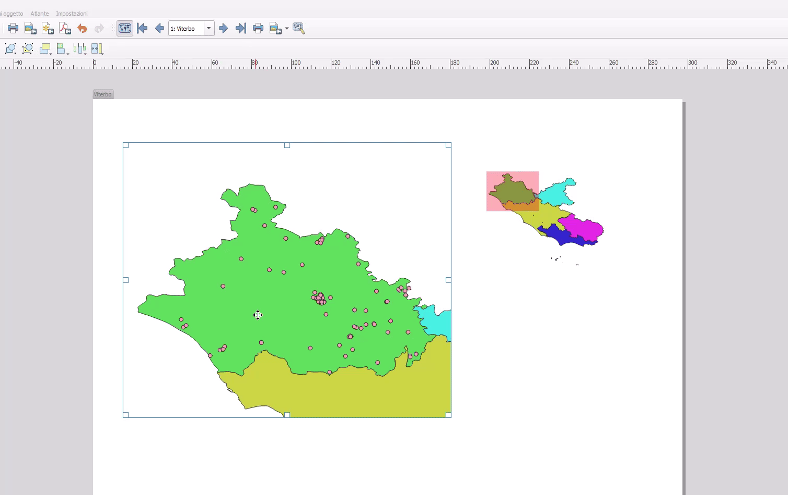

---
hide:
  # - navigation
  # - toc
title: Nascondere feature negli atlanti
description: Come nascondere delle feature non necessarie negli atlanti.
---

# Atlante dove nascondiamo dei punti

## Descrizione

Creare un atlante usando le province della Regione Lazio e visualizzare, per ogni provincia solo i punti di ricarica elettrica che vi ricadono dentro.

## Procedura

1. Scaricare il file csv ([Rete ricarica veicoli elettrici](https://raw.githubusercontent.com/ondata/rete_ricarica_veicoli_elettrici/main/data/rete_ricarica_veicoli_elettrici_cleaned.csv));
2. caricare il file appena scaricato in QGIS e applicare un filtro sulla regione Lazio;
3. Caricare lo shapefile delle Province ISTAT e filtrare solo quelle della regione Lazio;
4. tematizzare a piacere;
5. creare tre viste per visualizzare solo punti, solo province e per visualizzare entrambi;
6. creare un atlas con mappa principale e panoramica (generare atlante e collegarlo solo alla mappa principale);
7. tematizzare i punti tramite regola e usare come filtro `contains(@atlas_geometry,@geometry)`, occhio ai SR;

{!includes/disclaimer.md!}
