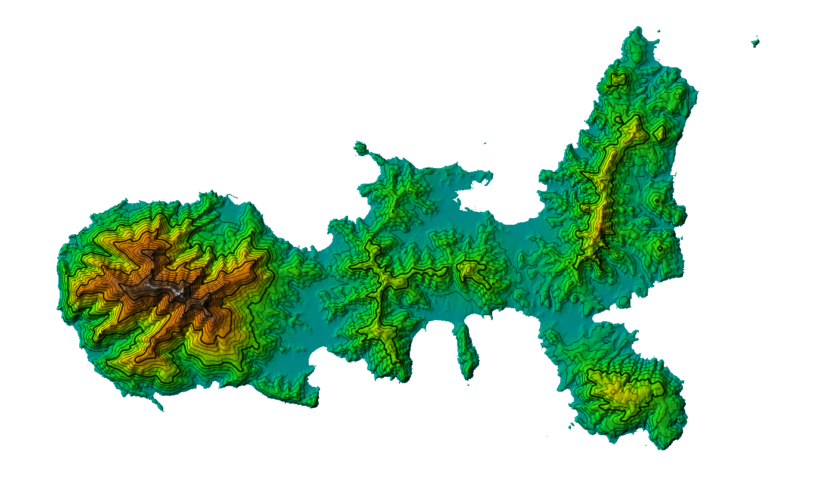

---
hide:
  # - navigation
  # - toc
title: Vestizione raster
description: Come tematizzare un raster
---

# Vestizione vettore

## Introduzione

Per vestizione intendiamo la tematizzazione di un raster.

## Tematizzazione

Tematizzare un DTM:

1. banda singola falso colore;
2. ombreggiatura;
3. curve di livello

{.center-img .img-80}

{!includes/disclaimer.md!}
