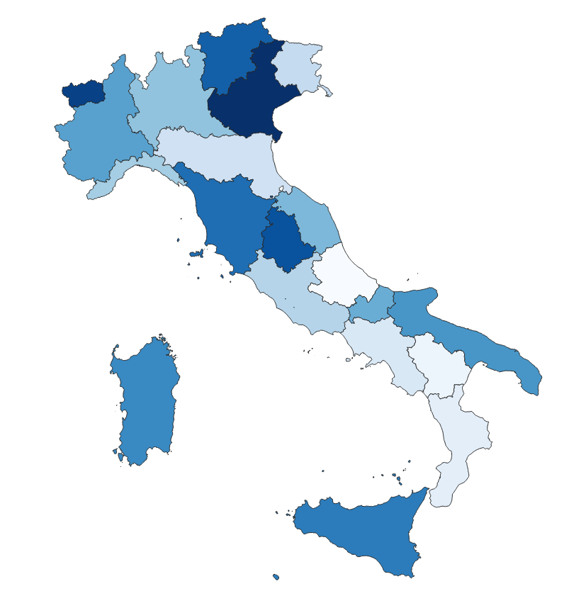
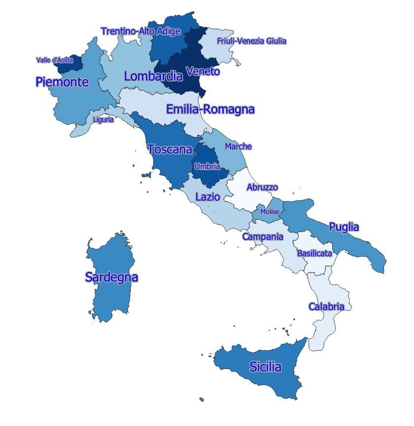

---
hide:
  # - navigation
  # - toc
title: Vestizione vettore
description: Come tematizzare ed etichettare un vettore
---

# Vestizione vettore

## Introduzione

Per vestizione intendiamo la tematizzazione ed etichettatura dei vettori.

## Tematizzazione

Creare una coropletica a partire dal vettore regioni italiane ISTAT

{.center-img .img-50}

## Etichettatura

Etichettare le regioni italiane ISTAT usando uno o più attributi o espressioni.

{.center-img .img-50}

{!includes/disclaimer.md!}
