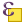

---
hide:
  - navigation
  # - toc
title: FAQ
description: Domande frequenti su QGIS
---

# FAQ - Domande Frequenti :material-help-circle:

Risposte alle domande più comuni su QGIS e il corso.

---

## :fontawesome-solid-download: Installazione e Configurazione

### Come installo QGIS su Windows?

1. Vai su [qgis.org](https://qgis.org/it/site/forusers/download.html)
2. Scegli **QGIS 3.40 LTR** (Long Term Release)
3. Scarica l'installer OSGeo4W per Windows
4. Esegui l'installer e segui le istruzioni
5. Scegli "Installazione Express Desktop" per un'installazione semplificata

### Quale versione devo installare?

Per questo corso usa **QGIS 3.40.x LTR Bratislava** (o versione successiva). Le versioni LTR sono più stabili e hanno supporto a lungo termine (circa 1 anno).

### Che differenza c'è tra versione LTR e Latest?

- **LTR (Long Term Release)**: versione stabile con supporto prolungato, ideale per uso professionale e produzione
- **Latest**: versione più recente con le ultime funzionalità, aggiornata frequentemente ma potenzialmente meno stabile

### QGIS si apre ma è lentissimo, cosa posso fare?

Possibili cause e soluzioni:

- **Troppi plugin attivi**: disabilita i plugin non necessari da `Plugin → Gestisci e installa plugin`
- **Progetti pesanti**: chiudi layer non utilizzati
- **Antivirus**: aggiungi QGIS alle eccezioni
- **Driver grafici**: aggiorna i driver della scheda video
- **Impostazioni OpenGL**: vai in `Impostazioni → Opzioni → Rendering` e prova a disabilitare "Usa Accelerazione Rendering"

---

## :material-projector-screen: Interfaccia e Uso Base

### Come cambio la lingua di QGIS?

`Impostazioni → Opzioni → Generale → Lingua interfaccia utente` → seleziona Italiano → riavvia QGIS

### Dove trovo la barra degli strumenti XYZ?

Non esiste di default. Devi:

1. Installare il plugin **QuickMapServices**
2. Oppure aggiungere tile XYZ manualmente: `Browser → XYZ Tiles → tasto destro → Nuova Connessione`

### Come faccio a vedere le coordinate del cursore?

Guarda nella **barra di stato** in basso a destra. Mostra le coordinate in tempo reale mentre muovi il mouse sulla mappa.

### Non vedo più un pannello, come lo recupero?

`Visualizza → Pannelli` e attiva quello che ti serve (Layer, Processing, Browser, etc.)

---

## :material-map: Sistemi di Coordinate e Proiezioni

### Cos'è l'EPSG e dove lo trovo?

EPSG è un codice numerico che identifica un sistema di coordinate. I più comuni in Italia:

- **EPSG:4326** - WGS84 (lat/lon geografiche)
- **EPSG:3857** - Web Mercator (Google Maps, OSM)
- **EPSG:32632** - UTM zona 32N (Italia centro-nord)
- **EPSG:32633** - UTM zona 33N (Italia centro-sud e isole)

Lo trovi in basso a destra nella barra di stato di QGIS.

### I miei layer non si sovrappongono, perché?

Probabilmente hanno sistemi di coordinate diversi. Verifica:

1. Controlla l'SR di ogni layer (tasto destro → Proprietà → Informazioni)
2. Verifica che la riproiezione al volo (OTF) sia attiva
3. Se necessario, riproietta i layer: `Processing → Toolbox → Riproietta layer`

### Come imposto il sistema di coordinate del progetto?

Clicca sul codice EPSG in basso a destra oppure vai in `Progetto → Proprietà → SR`

---

## :material-vector-polyline: Dati Vettoriali

### Come apro un file Shapefile?

- **Drag & drop**: trascina il file .shp nella finestra di QGIS
- **Menu**: `Layer → Aggiungi layer → Aggiungi layer vettoriale`
- **Browser**: trova il file nel pannello Browser e trascinalo

### Posso aprire più shapefile contemporaneamente?

Sì! Seleziona tutti i file .shp che vuoi (Ctrl+click) e trascinali insieme in QGIS.

### Come salvo un layer modificato?

- **Salva modifiche**: dopo aver editato, clicca su  o `Layer → Salva modifiche layer`
- **Salva come**: `Tasto destro sul layer → Esporta → Salva elementi come...`

### Qual è la differenza tra Shapefile e GeoPackage?

| Shapefile | GeoPackage |
|-----------|------------|
| Formato vecchio (anni '90) | Formato moderno (OGC standard) |
| Multipli file (.shp, .dbf, .shx, etc.) | Un singolo file .gpkg |
| Limite 2GB | Nessun limite dimensione |
| Nomi campi max 10 caratteri | Nessun limite nomi |
| Un solo layer per file | Multipli layer in un file |

**Consiglio**: usa sempre GeoPackage per nuovi progetti!

---

## :material-table: Tabella Attributi

### Come apro la tabella attributi?

- **Tasto destro** sul layer → `Apri tabella attributi`
- **Tasto F6**
- **Icona**  nella barra strumenti

### Come calcolo un nuovo campo?

1. Apri la tabella attributi
2. Clicca su  Calcolatore campi
3. Crea un nuovo campo o aggiorna uno esistente
4. Scrivi l'espressione
5. Clicca OK

### Come seleziono elementi per attributo?

Usa **Seleziona elementi usando un'espressione** 

Esempio: selezionare province con popolazione > 500000:
```
"popolazione" > 500000
```

---

## :material-function: Espressioni

### Cos'è un'espressione in QGIS?

Un'espressione è una formula che permette di calcolare valori dinamicamente usando:

- **Funzioni**: `area()`, `length()`, `concat()`, etc.
- **Operatori**: +, -, *, /, AND, OR
- **Campi**: nomi dei campi della tabella attributi
- **Variabili**: `@project_title`, `@map_scale`

### Dove posso usare le espressioni?

- Calcolatore di campi
- Etichette
- Simbologia (colori, dimensioni)
- Selezione elementi
- Layout di stampa
- Modellatore grafico

### Come concateno più campi?

Usa la funzione `concat()` o l'operatore `||`:

```
concat("comune", ' - ', "provincia")
```
o
```
"comune" || ' - ' || "provincia"
```

### Come formatto una data?

Usa `format_date()`:

```
format_date("data_rilevamento", 'dd/MM/yyyy')
```

---

## :material-image: Dati Raster

### Quale formato raster devo usare?

- **GeoTIFF**: standard universale, supporta compressione
- **COG**: ottimizzato per cloud e web
- **NetCDF**: dati multidimensionali (es: modelli climatici)

### Come visualizzo le bande RGB di un'immagine satellitare?

1. Apri il raster in QGIS
2. Proprietà layer → Simbologia
3. Tipo visualizzazione: **Multibanda a colori**
4. Assegna le bande: Rosso=B4, Verde=B3, Blu=B2 (per Sentinel-2)

### Come calcolo NDVI?

Usa il **Calcolatore Raster**:

1. `Raster → Calcolatore Raster`
2. Espressione: `(NIR - RED) / (NIR + RED)`
3. Per Sentinel-2: `("B8@1" - "B4@1") / ("B8@1" + "B4@1")`

### Dove scarico immagini Sentinel gratuite?

**Copernicus Open Access Hub**:
- [scihub.copernicus.eu](https://scihub.copernicus.eu)
- Dati gratuiti Sentinel-1, 2, 3, 5P
- Richiede registrazione gratuita

**Altri portali**:
- [earthexplorer.usgs.gov](https://earthexplorer.usgs.gov) (Landsat e altri)
- [Google Earth Engine](https://earthengine.google.com)

### Qual è la differenza tra Sentinel-1 e Sentinel-2?

| Sentinel-1 | Sentinel-2 |
|------------|------------|
| Radar SAR (C-band) | Ottico multispettrale |
| Funziona anche con nuvole | Bloccato dalle nuvole |
| Risoluzione 10-40m | Risoluzione 10-60m |
| Deformazioni, ghiacci, oceani | Vegetazione, uso suolo, agricoltura |
| Immagini in scala di grigi | Immagini a colori (13 bande) |

---

## :material-printer: Stampe e Layout

### Come creo una stampa?

1. `Progetto → Nuovo layout di stampa`
2. Inserisci gli elementi: mappa, legenda, scala, titolo, etc.
3. Esporta come PDF o immagine

### Cos'è un atlante?

Funzione che genera automaticamente una serie di mappe (una per ogni elemento di un layer). Utile per:

- Stampare una mappa per ogni comune
- Creare schede con foto diverse
- Report automatici

### Come aggiungo una freccia del nord?

`Aggiungi elemento → Aggiungi Immagine` → scegli un simbolo del nord dalla galleria

---

## :material-cog: Processing

### Dove trovo gli strumenti di processing?

`Processing → Barra degli strumenti` oppure `Ctrl+Alt+T`

Cerca lo strumento usando la barra di ricerca in alto.

### A cosa serve il Modellatore Grafico?

Permette di creare flussi di lavoro automatizzati:

- Concatenare più operazioni
- Riutilizzare processi ripetitivi
- Condividere procedure con altri utenti

Accesso: `Processing → Modellatore grafico`

### Come eseguo un algoritmo su più file?

Usa **Esecuzione in serie**:

1. Apri un algoritmo dal Toolbox
2. Clicca su `Esegui come processo in serie...`
3. Seleziona i file di input
4. Imposta i parametri
5. Esegui

---

## :material-language-python: Python e PyQGIS

### Serve sapere Python per usare QGIS?

No! QGIS può essere usato completamente tramite interfaccia grafica. Python è utile solo per:

- Automatizzare operazioni ripetitive
- Creare plugin personalizzati
- Sviluppare applicazioni custom

### Come apro la Console Python?

`Plugin → Console Python` oppure `Ctrl+Alt+P`

### Cos'è PyQGIS?

PyQGIS è l'API Python di QGIS che permette di:

- Accedere a tutte le funzionalità di QGIS via codice
- Creare script personalizzati
- Sviluppare plugin
- Automatizzare workflow complessi

### Esempio: come ottengo tutti i layer del progetto?

```python
from qgis.core import QgsProject

layers = QgsProject.instance().mapLayers()
for layer_id, layer in layers.items():
    print(f"{layer.name()}: {layer.featureCount()} elementi")
```

### Dove trovo documentazione PyQGIS?

- [PyQGIS Developer Cookbook](https://docs.qgis.org/latest/en/docs/pyqgis_developer_cookbook/)
- [QGIS API Documentation](https://qgis.org/pyqgis/)

---

## :material-puzzle: Plugin

### Come installo un plugin?

1. `Plugin → Gestisci e installa plugin`
2. Cerca il plugin
3. Clicca `Installa plugin`

### Plugin consigliati per iniziare

- **QuickMapServices**: mappe di base (OSM, Google, etc.)
- **QuickOSM**: scaricare dati da OpenStreetMap
- **HCMGIS**: strumenti utili vari
- **DataPlotly**: grafici interattivi

### Un plugin non funziona, cosa faccio?

1. Verifica che sia compatibile con la tua versione di QGIS
2. Controlla se ci sono aggiornamenti disponibili
3. Riavvia QGIS
4. Disabilita e riattiva il plugin
5. Controlla i log: `Visualizza → Pannelli → Messaggi di log`

---

## :material-database: Database Spaziali

### SpatiaLite o PostGIS?

**SpatiaLite** (SQLite):
- ✅ Singolo file, facile da spostare
- ✅ Non serve server
- ❌ Non ottimo per multi-utente

**PostGIS** (PostgreSQL):
- ✅ Eccellente per grandi dataset
- ✅ Multi-utente
- ✅ Funzioni spaziali avanzate
- ❌ Richiede server e configurazione

### Come creo un GeoPackage?

1. `Layer → Crea layer → Nuovo layer GeoPackage`
2. Oppure salva un layer esistente: `Esporta → Salva elementi come... → GeoPackage`

### Cos'è GDAL/OGR?

**GDAL** (Geospatial Data Abstraction Library):
- Libreria open source per leggere/scrivere formati raster
- Include centinaia di driver per diversi formati
- Usata da QGIS, ArcGIS, e molti altri software GIS

**OGR** (originariamente OpenGIS Simple Features Reference):
- Componente di GDAL per formati vettoriali
- Gestisce Shapefile, GeoPackage, GeoJSON, KML, etc.

### Come converto un formato vettoriale in un altro?

**Metodo 1 - Interfaccia grafica**:
1. Tasto destro sul layer → `Esporta → Salva elementi come...`
2. Scegli il formato di output
3. Imposta le opzioni
4. Salva

**Metodo 2 - Processing**:
1. `Processing → Toolbox`
2. Cerca "Riproietta layer" o "Package layers"
3. Scegli formato output

**Metodo 3 - GDAL (avanzato)**:
```bash
ogr2ogr -f "GeoJSON" output.geojson input.shp
```

---

## :material-bug: Problemi Comuni

### QGIS si blocca quando apro un progetto

- Controlla se ci sono layer con percorsi rotti
- Disabilita i plugin prima di aprire
- Verifica che i dati siano accessibili

### Le etichette si sovrappongono

Nelle proprietà del layer:

1. `Etichette → Visualizzazione`
2. Spunta "Impedisci alle etichette di coprire gli elementi"
3. Regola la priorità e le opzioni di posizionamento

### Gli elementi non si vedono ma sono presenti

Verifica:

1. **Scala**: controlla la scala di visualizzazione del layer (proprietà → Visualizzazione)
2. **Simbologia**: verifica colori e dimensioni
3. **Ordine layer**: sposta il layer più in alto nel TOC
4. **Extent**: zoom sull'extent del layer (tasto destro → Zoom al layer)

### Il calcolatore di campi non funziona

Assicurati di:

1. Aver attivato la modalità editing 
2. Il tipo di campo sia compatibile con l'espressione
3. Non ci siano errori di sintassi nell'espressione

### Come velocizzo le operazioni su layer grandi?

**Crea un indice spaziale**:
1. Tasto destro sul layer → `Proprietà`
2. `Sorgente → Crea indice spaziale`

Oppure da Processing: cerca "Create spatial index"

**Altri suggerimenti**:
- Salva in GeoPackage invece di Shapefile
- Usa filtri per lavorare su sottoinsiemi
- Semplifica geometrie se non serve alta precisione
- Chiudi layer non necessari

### Come funziona lo snap durante la digitalizzazione?

Lo **snap** (aggancio) permette l'aggancio automatico dei vertici:

1. `Progetto → Opzioni di aggancio`
2. Attiva lo snap per i layer desiderati
3. Scegli tipo: vertici, segmenti, area
4. Imposta tolleranza (in pixel o unità mappa)

**Shortcut**: premi `S` per aprire rapidamente le opzioni di snap

---

## :material-school: Corso e Materiale

### Dove trovo i dati del corso?

Nella sezione [Dati](dati/index.md) trovi tutti i link per scaricare il materiale didattico.

### Posso usare QGIS per lavoro?

Sì! QGIS è un software professionale usato da:

- Pubblica amministrazione
- Aziende private
- Università e centri di ricerca
- Liberi professionisti

È completamente gratuito anche per uso commerciale.

### Dove trovo aiuto dopo il corso?

**Community italiana**:
- **Mailing list**: [QGIS-it](https://lists.osgeo.org/mailman/listinfo/qgis-it-user)
- **Telegram**: Gruppo QGIS Italia
- **Forum GFOSS**: [forum.gfoss.it](https://forum.gfoss.it)

**Risorse internazionali**:
- **Stack Exchange**: [gis.stackexchange.com](https://gis.stackexchange.com/questions/tagged/qgis)
- **GitHub**: [github.com/qgis/QGIS/issues](https://github.com/qgis/QGIS/issues)

**Documentazione e tutorial**:
- **Manuale ufficiale**: [docs.qgis.org](https://docs.qgis.org/latest/it/)
- **YouTube**: [Pigrecoinfinito](https://www.youtube.com/@pigrecoinfinito)
- **Blog**: [pigrecoinfinito.com](https://pigrecoinfinito.com)

### Come posso contribuire a QGIS?

Puoi contribuire in molti modi:

- **Segnala bug**: su [GitHub Issues](https://github.com/qgis/QGIS/issues)
- **Traduzioni**: aiuta a tradurre l'interfaccia e la documentazione
- **Documentazione**: migliora il manuale utente
- **Sviluppo**: contribuisci al codice (Python, C++)
- **Plugin**: crea e condividi plugin utili
- **Supporto**: aiuta altri utenti nei forum
- **Donazioni**: [qgis.org/en/site/getinvolved/donations.html](https://qgis.org/en/site/getinvolved/donations.html)

---

!!! question "Non hai trovato risposta?"
    Scrivi la tua domanda durante il corso o contatta il docente!

{!includes/disclaimer.md!}
