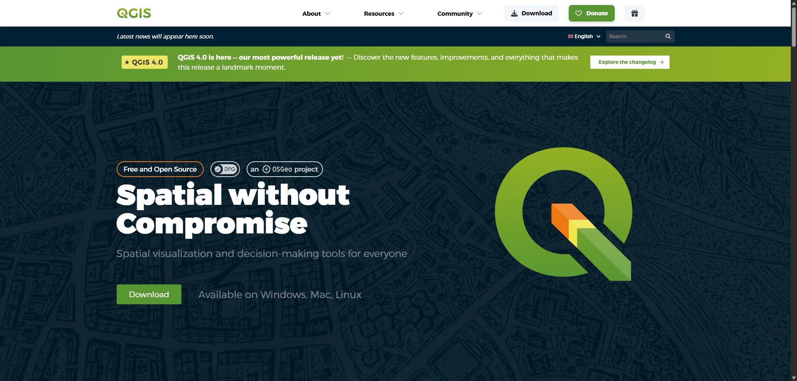
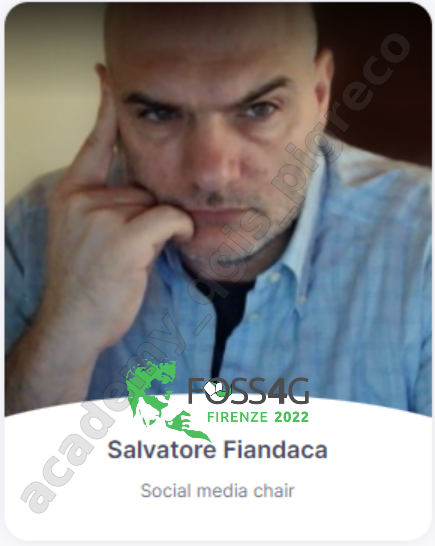

---
hide:
  - navigation
  #- toc
title: Academy Pigrecoinfinito QGIS
description: Academy Pigrecoinfinito QGIS Modulo QGIS
---

# Esempio di come creare documentazione usando Material for MkDocs
## MODULO QGIS

### 24 ore per diventare autonomo con QGIS!

---

⚠️_Riservato esclusivamente ai partecipanti del corso_⚠️

---

## 🏢 Chi Siamo

**Pigrecoinfinito** - Divulgazione e formazione geomatica

{.img-30 align=left}

**Pigrecoinfinito** è il progetto di divulgazione e formazione geomatica fondato dall'Ing. Salvatore Fiandaca, dedicato a rendere accessibili a tutti gli strumenti GIS open source, in particolare QGIS. Attraverso video tutorial, corsi, articoli e materiali didattici, Pigrecoinfinito accompagna professionisti, studenti e appassionati nel mondo della geomatica, con un approccio pratico, chiaro e orientato alla condivisione della conoscenza.

[:material-open-in-new: Vai al sito Pigrecoinfinito](https://pigrecoinfinito.com/){ .md-button }

---

## 🗺️ La Tecnologia

**QGIS - Spatial without Compromise**

{.img-50 align=left}

è un software GIS (Geographic Information System), che permette di analizzare ed editare dati spaziali e di generare cartografia. QGIS supporta sia dati vettoriali che raster oltre che i principali database spaziali come PostgreSQL/PostGIS o Spatialite. La forza di QGIS, inoltre, è che integra al suo interno gli algoritmi di processing di altri progetti open source, come GRASS GIS e SAGA GIS, in una interfaccia intuitiva.

Il software viene pubblicato come multipiattaforma e dal sito possono essere scaricate le compilazioni per macOS, Linux, UNIX, Microsoft Windows e Android.

Essendo distribuito come pacchetto [Open Source](https://it.wikipedia.org/wiki/Open_source), il codice sorgente di QGIS è liberamente messo a disposizione dagli sviluppatori e può essere scaricato e modificato. Il cuore di QGIS è scritto in C++ e supporta pienamente Python 3.

QGIS è mantenuto da una comunità di sviluppatori che pubblicano aggiornamenti versione (bugfixing) ogni mese, una nuova versione ogni 4 mesi circa e una Long Time Release (LTR) ogni anno secondo la roadmap del progetto. L'interfaccia è tradotta in numerose (circa 50) lingue (Anche in sardo!). _Nuova release QGIS 4 a partire da aprile 2026._

[:material-open-in-new: Vai al sito QGIS](https://www.qgis.org/it/site/){ .md-button } [:material-open-in-new: Vai al repositoryo QGIS](https://github.com/qgis/QGIS){ .md-button }

---

## 🗣️ Il Docente

**Ing. Salvatore FIANDACA**

{.img-10 align=left}

conosciuto come _Pigrecoinfinito_ o semplicemente _pigreco_, è una figura di spicco nel mondo della divulgazione geomatica in Italia. Nato il 29 maggio a Charleroi (Belgio), **Fiandaca** ha sviluppato fin da giovane una passione per la geomatica, che lo ha portato a laurearsi in ingegneria Civile con specializzazione in Geomatica all'Università degli Studi di Palermo.
Il soprannome "_Pigrecoinfinito_" deriva dal suo amore per il numero π (pi greco), simbolo della sua dedizione alla matematica e alla costante ricerca di conoscenza. **Fiandaca** è noto per la sua capacità di rendere accessibili concetti complessi attraverso [i suoi video educativi su YouTube](https://www.youtube.com/@pigrecoinfinito), dove il suo canale "_Pigrecoinfinito_" ha guadagnato un ampio seguito. _Technical Advisor_ presso _Pigrecoinfinito Italia_ (SBU Government & Security) dal 2022. Dal 2026 ha il QGIS Certification.

[:material-open-in-new: Vai al sito Pigrecoinfinito](https://pigrecoinfinito.com/){ .md-button } [:material-open-in-new: Vai al canale YouTube Pigrecoinfinito](https://www.youtube.com/@pigrecoinfinito){ .md-button }

