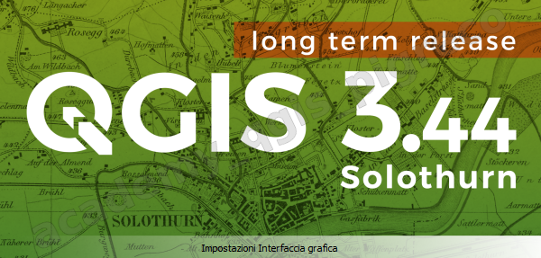
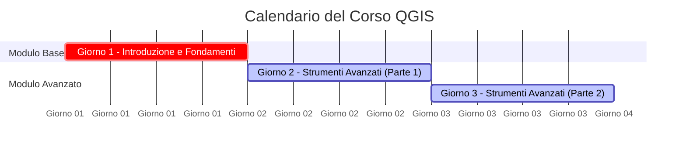

---
hide:
  - navigation
  #- toc
title: Intro
description: Introduzione al corso base su QGIS 3.x
---

# Corso QGIS 3.x 2026

Durante questo corso intensivo di 24 ore imparerai a utilizzare QGIS in modo completo, partendo dalle basi fino ad arrivare a strumenti avanzati per l’analisi e la gestione dei dati spaziali, seguendo questo percorso:

**Step 1 — Fondamenti e interfaccia**

- Acquisirai familiarità con l’interfaccia grafica di **QGIS**.
- Imparerai a gestire le proiezioni.

**Step 2 — Gestione dei dati**

**Step 3 — Plugin e fonti esterne**

**Step 4 — Automazione e analisi avanzata**

**Step 5 — Cloud, stili e riga di comando**

Alla fine del corso sarai in grado di usare **QGIS** in modo professionale per creare, analizzare e rappresentare dati geografici con efficienza e precisione.

---

Versione utilizzata **QGIS 3.44.x Solothurn LTR**

   

## Programma :octicons-book-16:

=== "Programma BASE su QGIS 3.x"

    circa 12 ore
    
      - Breve introduzione a QGIS 3 e 4 ed altri GIS desktop Open Source
      - Installazione di QGIS in Windows 10 e 11
      - Interfaccia utente - TOC - canvas - menu - processing
      - Gestione delle proiezioni - EPSG - OTF
      - Gestione dei plugins - sperimentali, obsoleti
      - Formati di dato geografici
      - I dati geografici vettoriali:
          - proprietà, importazione ed esportazione, conversione fra formati
          - vestizione vettoriale ed etichettatura avanzata
          - tabelle dati, attributi ed azioni
          - importazione di dati tabellari - CSV - CSVT
          - cenni sul calcolatore di campi
          - cenni su join e relazioni
          - cenni operazioni di spatial join
          - digitalizzazione dei vettori
      - I geodatabase e QGIS: PostgreSQL/PostGIS e SpatiaLite, virtual layer (cenno)
      - Caricare dati dal web: Google Maps, QuickMapServices, OSM, WMS, WFS
      - Gestione di fotografie georeferenziate
      - Esportazione dati per Google Earth - kml/kmz
      - I dati geografici raster (cenni):
          - caratteristiche, proprietà e vestizione
          - migliorare la visualizzazione, panoramiche, COG
          - DTM, DSM, profili
          - mosaici/cataloghi
          - cenni sul calcolatore raster
      - Creazione di animazione di dati temporali (cenno)
      - Visualizzazione 3D (cenno)
      - Print Layout, Atlanti (cenni)
      - Mailing List GFOSS e QGIS Italia, bugfix 

=== "Programma AVANZATO su QGIS 3.x ed esercitazioni"

    circa 12 ore
    
    - Motore delle espressioni di QGIS:

    - Compositore di stampe di QGIS:

    - Strumenti di processing:

    - Plugin georeferenziatore:

    - Raster

    - Varie...

---

Monte ore: :clock3: **24 h** (1)
{ .annotate }

1.  :man_raising_hand: --> **3** sessioni da **8 ore** con 60 min di pausa

## Organizzato da Pigrecoinfinito

   

## Docente :material-account-check:

- **Ing. Salvatore FIANDACA**  (Membro [OpenDataSicilia](http://opendatasicilia.it/) (2014) , Membro [QGIS Italia](http://qgis.it/) (2015), Socio [GFOSS.it APS](https://gfoss.it/) (2017), Membro [QGIS organization](https://github.com/qgis) (2020), Technical Advisor [Planetek](https://www.planetek.it/) (2022))

   

## Calendario :material-calendar:

Il corso si articola in **3 sessioni** da 8 ore ciascuna. Le date vengono definite e comunicate ai partecipanti in fase di organizzazione.

| sessione | data      | ora          | argomento                |
| -------- | --------- | ------------ | ------------------------ |
| 1        | 1ª giornata | 9:00 - 18:00 | modulo base              |
| 2        | 2ª giornata | 9:00 - 18:00 | modulo avanzato 1° parte |
| 3        | 3ª giornata | 9:00 - 18:00 | modulo avanzato 2° parte |

## Discenti :material-account-multiple-check:

L'elenco dei partecipanti viene definito in fase di iscrizione. La tabella seguente è un modello di riferimento.

| Nro | Foto | Nome | Cognome | Categoria | Sesso | Corso Base | Corso Avanzato |
| --- | ---- | ---- | ------- | --------- | ----- | ---------- | --------------- |
| 1 |  | Nome | Cognome | | | | |
| 2 |  | Nome | Cognome | | | | |
| 3 |  | Nome | Cognome | | | | |

## Piattaforme e Software

- :fontawesome-brands-windows: Windows 11 Pro 64b - come SO
- :simple-qgis: QGIS 3.44 LTR Solothurn
- :material-folder-zip: Materiale [didattico](./dati/index.md)
